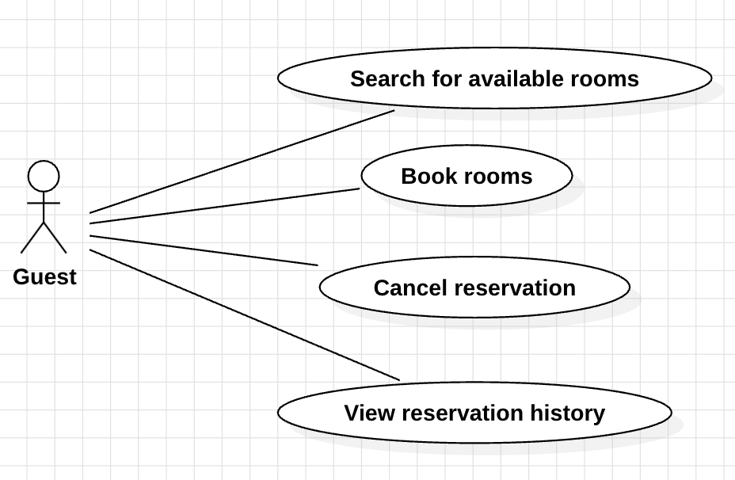
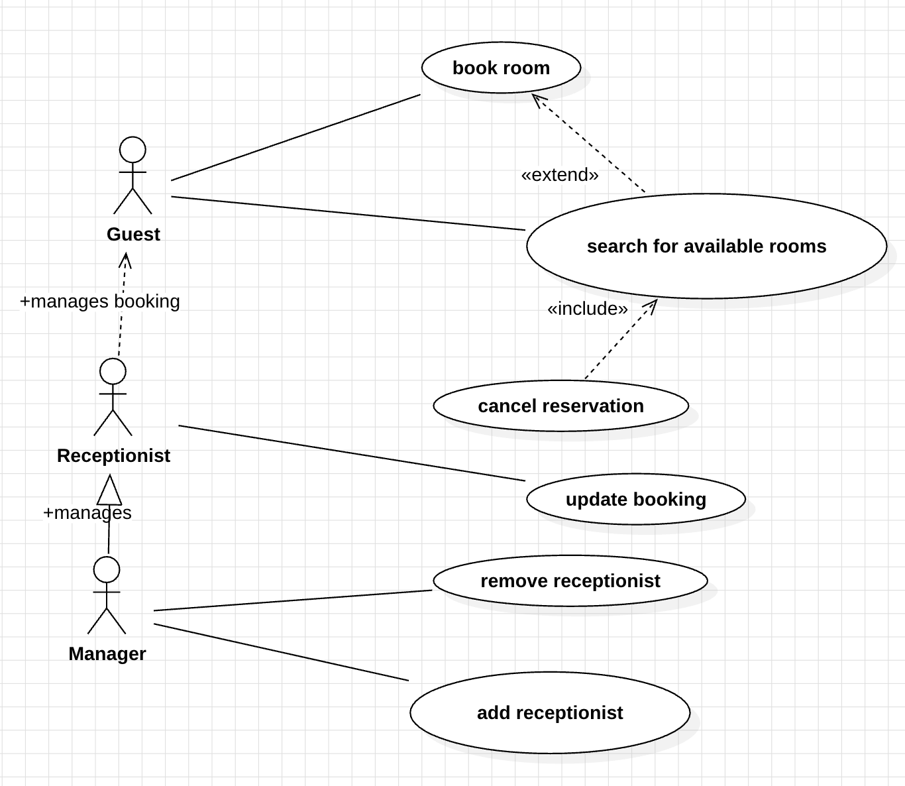

### User stories:

**Guest:**
As a guest, I want to search for available rooms, so that I can see what options I can have this hotel

As a guest, I want to cancel reservations, so that I can have a better deal at a nearby hotel

As a guest, I want to view my reservation history, so that I can acknowledge what is my total spending in this hotel

**Receptionist** 

As a receptionist, I want to add new bookings, so that I can reserve a slot for a new guest

As a receptionist, I want to cancel booking, so that a room can be free for use for somebody else

As a receptionist, I want to check guest reservation history, so that I can acknowledge the guest when was the last time he stayed here.

**Manager**

As a manager I can add a new receptionist, so that I can onboard my new employee as a receptionist

As a manager, I want to generate revenue reports, so that I can make a report to the CEO about how well the hotel is going.

As a manager, I want to view occupancy reports, so that I can make decisions on how can I plan the upcoming company trip

### Detailed use case for guest

### Detailed use case for everyone

